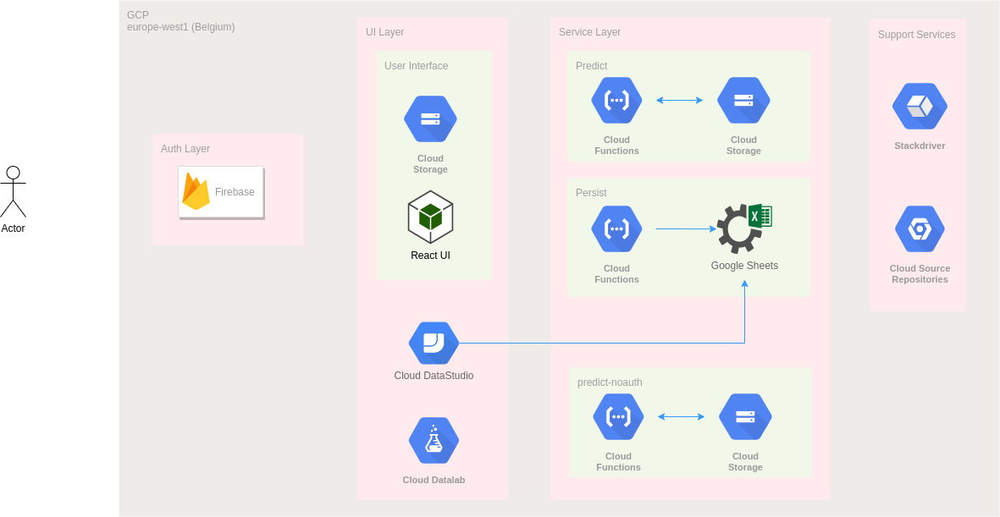

# gcp

`gcp` is a child project of the parent project [day-offers-machine-learning](../).

This module contains the design and code artefacts for the deployment of a Machine Learning process in GCP.

The module contains the following cloud services:

Service | Description
------------ | -------------
[Firebase](https://firebase.google.com/) | Authentication layer - used for user management and application authentication.
[Cloud Storage](https://cloud.google.com/storage) | Object storage used to store the ML models and serve the static Calculator web application.
[Cloud Functions](https://cloud.google.com/functions) | Functions-As-A-Service used for ML prediction and result persistence to a Google Sheet.
[Cloud Operations](https://cloud.google.com/products/operations) | Monitor, troubleshoot, and improve application performance on the Google Cloud environment.
[Google Sheets](https://developers.google.com/sheets) | Online spreadsheet app used to persist the data from the prototype Calculator web application.
[Cloud DataStudio](https://datastudio.google.com/) | Interactive dashboard that integrates with the Google Sheet to visualize data.
[Cloud DataLab](https://cloud.google.com/datalab) | Jupyter notebooks for data exploration, analysis, visualization, and machine learning.

# Sub-modules

The module contains the following sub-modules:

Sub-module | Description
------------ | -------------
[calculator-ui](calculator-ui) | Calculator web application created in [React](https://reactjs.org/).
[datalab](datalab) | Contains Jupyter notebooks for data exploration, analysis, visualization, and machine learning of day offer data.
[functions](functions) | Contains the Python code for [Cloud Functions](https://cloud.google.com/functions); `predict`, `predict-noauth` and `persist`.